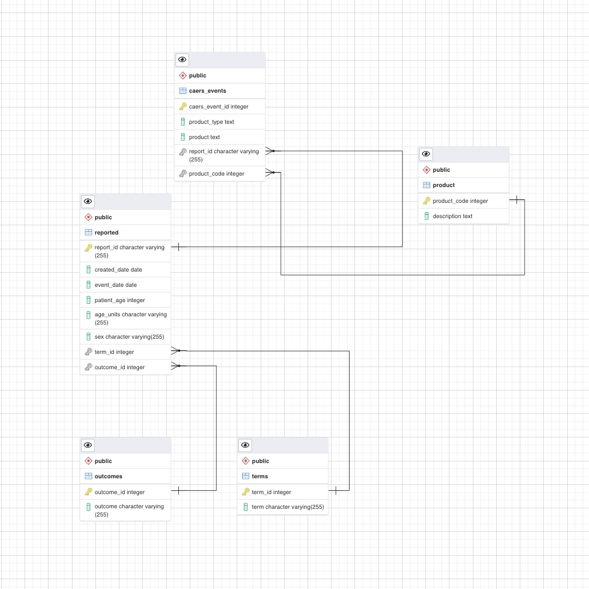

## Part 1: Create an ER Diagram by inspecting tables

- countries table has a one-to-many relationship with country_languages, because a foreign key, country_id, in country_languages references to countries.
- countries table has a one-to-many relationship with country_stats, because a foreign key, country_id, in country_stats references to countries.
- region table has a one-to-many relationship with countries, because a foreign key, region_id, in countries references to region.
- region_areas table has a one-to-many relationship with regions, because a foreign key, name, in region references regions_area.
- continents table has a one-to-many relationship with regions, because a foreign key, continent_id, in regions references continents.
- languages table has a one-to-many relationship with country_languages table, because a foreign key, language_id, in country_languages references languages.

## Part 3: Examine a data set and create a normalized data model to store the data

1. This query tries to determine whether or not report_id is unique.

   ```
       report_id    | count
   -----------------+-------
    180072          |     3
    181790          |     4
    204980          |     3
    184966          |     2
    180281          |    10
    174642          |     2
    192864          |     2
    189026          |     2
    180555          |     2
    ...             |   ...
   ```

   We could find the report_id is not unique in the staging table. It means that there are some duplicates, which could be reduced creating a new table to store the report_id as primary key and other functional dependency.

2. This query tries to determine whether or not report_id has one to one mapping with created_date, event_date, patient_age, age_units, sex, terms, and outcomes.

   ```
    report_id | count | count | count | count | count | count | count
   -----------+-------+-------+-------+-------+-------+-------+-------
   (0 rows)
   ```

   We found that report_id has one to one mapping with created_date, event_date, patient_age, age_units, sex, terms, and outcomes, all these columns. So, we could separate these columns out to make a new table.

3. This query tries to determine whether or not caers_event_id is unique.

   ```
    caers_event_id | count
   ----------------+-------
   (0 rows)
   ```

   caers_event_id looks unique.

4. This query tries to determine whether or not product_code is unique.

   ```
    product_code | count
   --------------+-------
                 |    18
    12           |   121
    54           | 28221
    41G          |    61
    7            |   296
    13           |   313
    15           |    59
    28           |   145
    52           |     5
    5            |   589
    ...          |   ...
   ```

   We found the product_code is not unique. We could find the functional dependency and create a new table.

5. This query tries to determine whether or not product_code and description are one to one mapping (each description has a product_code).

   ```
    product_code | count
   --------------+-------
    9            |     2
    20           |     2
    5            |     2
    16           |     2
   (4 rows)
   
    product_code |         description
   --------------+------------------------------
    16           | Fishery/Seafood Prod
    20           |  Fruit/Fruit Prod
    20           | Fruit/Fruit Prod
    5            |  Cereal Prep/Breakfast Food
    9            | Milk/Butter/Dried Milk Prod
    9            |  Milk/Butter/Dried Milk Prod
    16           |  Fishery/Seafood Prod
    5            | Cereal Prep/Breakfast Food
   (8 rows)
   ```

   product_code seems not have one to one mapping with description, but if we look at them in depth, we could find the only difference seems the space at the front, which could be eliminated when insert data.



- In the previous exploration part, we found that report_id has one to one mapping with created_date, event_date, patient_age, age_units, sex, terms, and outcomes. So we make a table called reported to store these columns.
- At the same time, terms and outcomes column contain multiple values in each field, so we need two tables for these two columns. With outcome_id as primary key in the outcomes table, which has a one to many relationship with reported table. As well as term_id as primary key in the terms table, which has a one to many relationship with reported table.
- We also found that product_code has one to one mapping with product (nearly one to one, because there are cases where one product code points to several different elements, but the only difference between these elements is the space in the front; I believe this could be eliminated when insert value into the table).
- Finally, we have caers_events table with caers_event_id as primary key and reported_id and product_code as foreign keys. Because there are one-to-many relationship between these tables.
